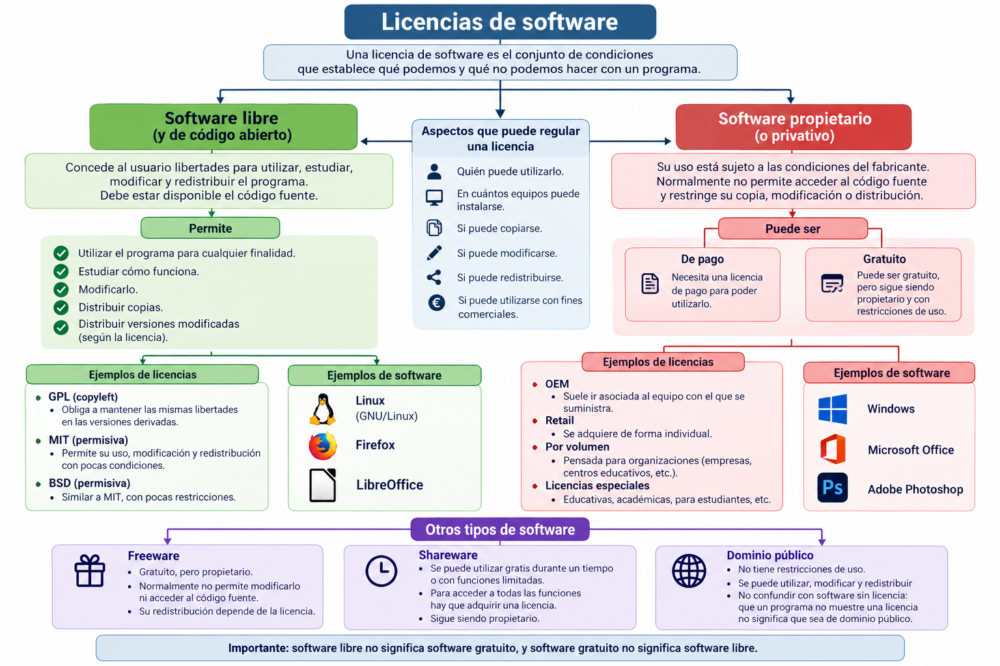

# UT1.2 Introducción a los sistemas informáticos: software 

## Contenido y debate introductorio

<iframe width="560" height="315" src="https://www.youtube.com/embed/8SdPLG-_wtA" title="YouTube video player" frameborder="0" allow="accelerometer; autoplay; clipboard-write; encrypted-media; gyroscope; picture-in-picture; web-share" allowfullscreen></iframe>

## El software

```note
💡 El **software** es el conjunto de instrucciones y programas, parte intangible, que utiliza un ordenador o computadora para funcionar y que se almacena en su memoria.
```

Comúnmente se utiliza este término para referirse de una forma muy genérica a los programas de un dispositivo informático, la parte **lógica** de un ordenador.

Para que un ordenador funcione necesita información o **datos** con los que trabajar. Esta información es de varios tipos dependiendo de su función. El ordenador puede servir para procesar información en forma de datos, los cuales pueden ser textos, imágenes, datos de sensores, hojas de cálculo,
tablas de una base datos, etc.

1.  **Datos de entrada**: Los que se suministran al ordenador desde los periféricos de entrada (teclado, ratón, escáner) o soportes como disocs (HDDs, DVDs, etc). Forman parte de la primera fase del tratamiento de la información denominada **entrada**.
    
2.  **Datos intermedios:** Son los que se obtienen en el tratamiento de la información denominada **proceso**.
    
3.  **Datos de salida**: se denominan también resultados del proceso de tratamiento: **salida**.

Para que los componentes electrónicos de un ordenador sean capaces de funcionar y realizar un proceso determinado, es necesario ejecutar un conjunto de órdenes o instrucciones.

> 📌 Se denomina **programa** al conjunto de **instrucciones** ordenadas y adecuadas para llevar a cabo un determinado proceso.

> 📌 El **software básico** para hacer funcionar cualquier ordenador se denomina sistema operativo y es lo que estudiaremos en este módulo junto con diversos programas.

> 📌 El **sistema operativo** es el componente software de un sistema informático capaz de hacer que los **programas** (**software**) procesen información (**datos**) sobre los componentes electrónicos de un ordenador o sistema informático (**hardware**).


## Clasificación del software

El software se suele clasificar de forma típica en tres tipos según su función como veremos a continuación:

- Software del sistema

- Software de programación

- Software de aplicación


### Software del sistema (base)

```note
💡 El **software de sistema** también llamado **software de base** es el conjunto de programas que sirven para interactuar con el sistema informático, confiriendo control sobre todo el hardware, además de dar soporte a otros programas.
```

Este software se divide en:

-   Sistemas Operativos
-   Controladores de dispositivos (drivers)
-   BIOS/UEFI
-   Hipervisores de Máquinas Virtuales
-   Gestores de arranque
-   Otros programas (como *OpenGL, directX*..)

### Software de programación

```note
💡 El **software de programación** es un conjunto de herramientas software que permiten al desarrollador informático escribir programas usando diferentes alternativas y lenguajes de programación (muchos de ellos específicos para cada uno de ellos)
```

Este tipo de software incluye principalmente:

-   Editores de código
-   Compiladores y depuradores de código
-   Intérpretes o ensambladores
-   Entornos de desarrollo integrado (IDEs)


### Software de aplicación

```note
💡 El **software de aplicación** son los programas diseñados para los usuarios para la realización de tareas específicas en los ordenadores o dispositivos para los que han sido diseñados.
```

- Creación de documentos
    - Word, Writer, Google Docs
- Navegar y buscar información
    - Chrome, Firefox, Edge
- Comunicarse
    - Outlook, Gmail, Teams, Slack
- Crear contenido 
    - Photoshop, GIMP, Canva, OBS
- Trabajo con IA
    - ChatGPT, Gemini, Copilot

**Aplicaciones de propósito general**

Son aplicaciones diseñadas para resolver tareas comunes en múltiples sectores y entornos profesionales, no para una actividad especializada concreta.

Categorías:
- Ofimática (procesadores de textos, hojas de cálculo, presentaciones..)
- Bases de datos.
- Navegadores web.
- Correo electrónico.
- Mensajería y videoconferencia.
- Compresión de archivos.
- Transferencia de ficheros.
- Edición básica multimedia.
- Lectores y editores PDF.
- Herramientas colaborativas 

**Aplicaciones de propósito específico**

Son aplicaciones diseñadas para una actividad o sector determinado:

Ejemplos:
- Ingeniería
- Gestión empresarial
- Asesorías
- Creación 3D
- Redes de telecomunicaciones

La elección del software debe depender de las necesidades, compatibilidad, coste, seguridad, soporte, facilidad de uso y licencia.


### Otras clasificaciones

El software también se suele clasificar siguiendo el siguiente esquema:


## Licencias de software

```note
Una licencia de software es el conjunto de condiciones legales que establece qué podemos y qué no podemos hacer con un programa.
```

Dependiendo de la licencia, se puede regular:
- Quién puede utilizar el programa.
- En cuántos equipos puede instalarse.
- Si puede copiarse.
- Si puede modificarse.
- Si puede redistribuirse.
- Si puede utilizarse con fines comerciales.

### EULA

Cuando compramos o bajamos de Internet un programa, al instalarlo solemos aceptar sin leer (*mala costumbre*) un contrato que especifica el tipo de **Licencia** de uso del software, en inglés *EULA *o *End User License Agreement*: licencia por la cual el uso de un producto sólo está permitido para un único usuario (el comprador). Es un acuerdo unilateral puesto que el usuario no tiene más opción que aceptar o rechazar el contenido del mismo.

```note
Comprar software no significa necesariamente comprar el programa.
Normalmente estamos adquiriendo el derecho a utilizarlo bajo determinadas condiciones.
```

### Código fuente

```note
El **código fuente** de un programa son su conjunto de instrucciones con el que está escrito, en un lenguaje de programación en específico.
```

Esas instrucciones, escritas en un lenguaje de programación, son las que le dicen al ordenador qué tiene que hacer paso a paso.

Una analogía del código fuente como la receta de cocina escrita por el programador:
- El programador escribe la receta (el código).
- El ordenador sigue esas instrucciones para preparar el “plato” (el programa o aplicación funcionando).

### Software libre vs propietario

Para cada uno de estos tres tipos de software vistos anteriormente, es necesario distinguir entre software libre o software, dependiendo de las **licencias** y permisos para su uso:

-   **Software libre** es el que otorga libertad de uso, copia y distribución a los usuarios. Su código puede ser totalmente abierto o estar sometido a ciertas normas según la licencia asociada concreta a ese programa.
    
-   **Software de propietario** es aquel cuyas condiciones de uso, copia y  distribución están sometidas a normas o restricciones. Su código fuente es cerrado, es decir, no está disponible para el usuario (el propietario puede mostrarlo, pero esto no implica que pase a ser software libre en  cuanto a su uso).


| **SOFTWARE LIBRE**                                                                                                                                                                                                   | **SOFTWARE PROPIETARIO**                                                                                                                                              |
|----------------------------------------------------------------------------------------------------------------------------------------------------------------------------------------------------------------------|-----------------------------------------------------------------------------------------------------------------------------------------------------------------------|
| No está limitado a los usuarios y garantiza las libertades de usar, modificar, copiar y distribuir software                                                                                                          | Tiene licencias que limitan a los usuarios y que, en algunos casos, son costosas. Estas licencias restringen las libertades de usar, modificar y distribuir software. |
| Puede intervenir en su desarrollo cualquier persona, empresa u organización, por lo que se generan gran cantidad de ideas innovadoras, y permite la adecuación a los avances tecnológicos.                           |  El desarrollo, la actualización y la programación de este software solo lo realiza la empresa que tiene los derechos.                                                |
| Los avances, modificaciones y descubrimientos tecnológicos son constantes y se encuentran en Internet de forma gratuita. “La principal meta del software libre es compartir los avances tecnológicos con los demás.” |  El futuro del software que adquirió el usuario solo depende de una empresa comercial.                                                                                |
| Compatible tanto en software como en hardware, no obliga al usuario a cambiar de sistema operativo o equipo.                                                                                                         | Siendo creado con fines de lucro, las actualizaciones o mejoras al software quedan estipuladas bajo contrato.                                                         |


Aunque se confunden, software de **código abierto** y el **software libre** no son exactamente lo mismo debido a diferencias sutiles de concepto.

### Software libre (GNU)

```note
💡 El proyecto **GNU** fue iniciado en 1984 por Richard Stallman y fundó la Free Software Foundation sin ánimo de lucro.
```

Se fundamenta en la moral y exige la libertad absoluta del software. **Cuatro** libertades del software libre:

1.  La libertad de usar el programa, con cualquier propósito. (libertad 0)

2.  La libertad de estudiar cómo funciona el programa, y adaptarlo a tus necesidades (libertad 1)
    
3.  La libertad de distribuir copias, con lo que puedes ayudar a tu vecino (libertad 2)
    
4.  La libertad de mejorar el programa y hacer públicas las mejoras a los demás, de modo que toda la comunidad se beneficie (libertad 3)

>   **El software libre no referencia a que sea gratis** (de hecho no siempre lo es)


### Software de código abierto (Open Source)

El **software de código abierto** se basa en un modelo de desarrollo que permite acceder al código fuente, modificarlo y redistribuirlo según las condiciones establecidas por su licencia.

El término **open source** (código abierto) surge a finales de los años 90 con la creación de la **Open Source Initiative (OSI)** y la **LinuxFoundation** en los 2000.

Frente al movimiento del **software libre**, que pone especial énfasis en las libertades del usuario y en aspectos éticos, el movimiento Open Source adopta un enfoque más pragmático, centrado en las ventajas prácticas del desarrollo abierto, como la colaboración, la reutilización del código, la transparencia y mejora colectiva.

```note
Software libre y open source no son categorías opuestas. Muchas licencias, como GPL, MIT, BSD o Apache, pueden considerarse al mismo tiempo licencias de software libre y de código abierto.
```


### Software propietario

El **software propietario** es aquel que sin permiso del propietario queda prohibida la copia, redistribución o modificación como hemos visto. Para poder usar se suele pedir permiso a la organización que lo desarrolló. Generalmente para su disponibilidad hay que pagar bajo unos derechos de autor (un **Copyright**).

En conclusión, los propietarios son los que establecen los derechos de uso, distribución, redistribución, copia, modificación, cesión y en general cualquier otra consideración que se estime necesaria. 

Los fabricantes de programas sometidos a este tipo de licencias por lo general ofrecen servicios de soporte técnico y actualizaciones durante el tiempo de vida del producto, también regulan el número de copias que pueden ser instaladas e incluso los fines concretos para los cuales puede ser utilizado.


### Licencias de software propietario

Tipos de licencias de **software propietario**:

-  **Licencias de usuario final**: Es el tipo más común de licencia en software propietario. Define los derechos y responsabilidades del usuario final en el acuerdo EULA, incluyendo las restricciones de uso, instalación y la prohibición de ingeniería inversa, redistribución o modificación del software.

-   **Licencias OEM**: se trata de un tipo de licencia que supedita su venta a que forme parte de un equipo nuevo, estando prohibido venderlo si no es bajo esta condición.
    
-   **Licencias Retail**: son las versiones a la venta ‘normal’ de software a través de cualquier canal. En este caso, el programa es de la entera propiedad del usuario, pudiendo éste cederlo libremente a terceros o venderlo.
    
-   **Licencias por volumen (VLM)**: es un tipo de licencia de software destinado a grandes usuarios (empresas), normalmente bajo unas condiciones similares a las de las licencias OEM, aunque sin estar supeditadas a equipos nuevos.

-  **Alquiler o suscripción:** El cada vez más habitual modelo de suscripción. El tipo más común es el conocido como Software como servicio (SaaS). Estas son cada vez más habituales, especialmente en las implementaciones cloud. Con este modelo de pago de licencias, la empresa paga una cantidad bastante menor de coste inicial. 

    
-   **Otro tipo de licencias especiales**: Por ejemplo las licencias de educación o de sectores específicos como el militar.

### Licencias de software libre

#### Tipos de licencias de software libre

-   **Licencias GPL (GNU General Public License).** Es una licencia que permite a su desarrollador conservar sus derechos como autor, pero permitiendo su libre distribución modificación y uso con una serie de restricciones:
    -   El nuevo software o modificación debe tener la misma licencia.
    -   El uso de partes en otro software también obliga a hacer uso de la misma licencia.
    
-   **Licencias BSD (Berkeley Software Distribution):** Es un tipo de licencia conocida por ser menos “restrictiva” lo que permite que desarrolladores puedan modificar, distribuir e incluso vender el software derivado.

-   **Licencia MIT**: Muy permisiva, permite a los usuarios usar, modificar y redistribuir el software, incluso en productos propietarios, siempre y cuando se mantenga el aviso de copyright original.

- **Licencia Apache** Permite la modificación y redistribución del software bajo otras licencias, siempre que se mantengan los avisos de derechos de autor y licencias.

#### Creative Commons (CC)

Las licencias **Creative Commons (CC)** no están pensadas para software, sino para contenido de obras culturales, educativas o artísticas.

Esta licencia posibilita un modelo legal de distribución y uso de contenidos basada en 4 condiciones principales que pueden ser combinadas para hacer licencias mixtas:
    
-   **Atribución**: Se conceden derechos de copia, distribución, exhibición y derivación siempre y cuando se reconozca y cite la obra de la forma especificada por el autor o el licenciante.
    
-   **No Comercial**: Se puede copiar, distribuir, exhibir y representar la obra y hacer obras derivadas pero sin fines comerciales.
    
-   **No Derivadas**: En este caso podemos copiar, distribuir, exhibir y representar copias literales de la obra pero no producir obras derivadas.
    
-   **Compartir Igual**: El usuario tiene el derecho de distribuir obras derivadas pero siempre con una licencia idéntica a la de la obra original.
    
-   **Licencias MIT**: Licencia de Instituto Tecnológico de Massachusetts. Es una licencia con casi ninguna limitación de uso o modificación y que no tiene restricción en el uso de software pudiendo tener variantes privativas del mismo. Software libre no significa *no comercial*.
    
    Un programa libre debe estar disponible para uso comercial, desarrollo comercial y distribución comercial. El desarrollo comercial del software libre ha dejado de ser inusual y el software comercial libre es muy importante.

#### Dominio público

Las licencias de **dominio público** (como la **CC-0**) son licencias que otorgan derechos de dominio público o actúan como exenciones. Se utilizan para hacer que los trabajos con derechos de autor sean utilizables por cualquier persona sin condiciones, al tiempo que se evitan las complejidades de la atribución o la compatibilidad de licencias que se producen con otras licencias.

No se requiere ningún permiso o licencia para usar trabajos del dominio público, así como aquellos con un copyright expirado.


### Cuadro resumen licencias


|                                                              |                                                              |
| ------------------------------------------------------------ | ------------------------------------------------------------ |
| **Software Libre** <br />Uso gratuito (existen excepciones) <br />Se puede modificar <br />Se pueden distribuir los cambios | **Software privativo o propietario** <br />Se paga por cada licencia<br />No se puede modificar |
| **Dominio público** <br />Software sin licencia. <br />Se permite uso, copia, modificación o <br />redistribución con o sin fines de lucro. | **Modelo shareware** <br />Se prueba y luego se paga <br />Privativo. No se puede modificar |
|                                                              | **Modelo freeware** <br />Uso gratuito <br />Privativo. No se puede modificar |


