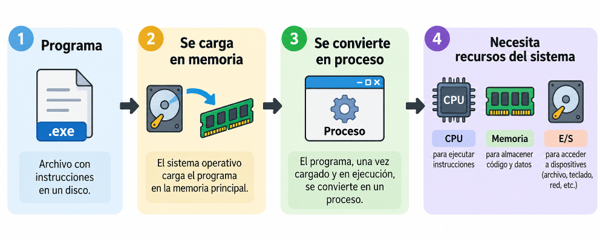
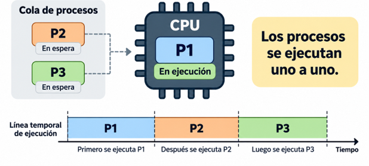
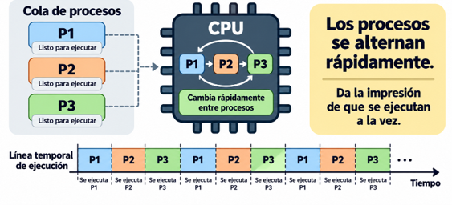
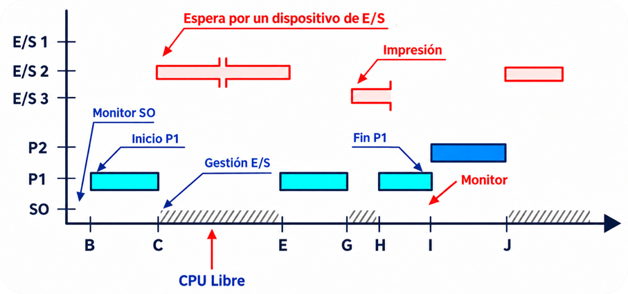
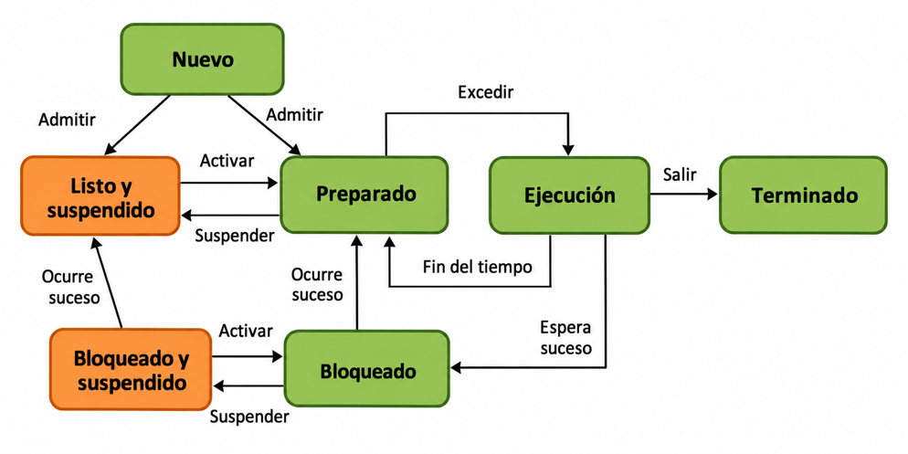
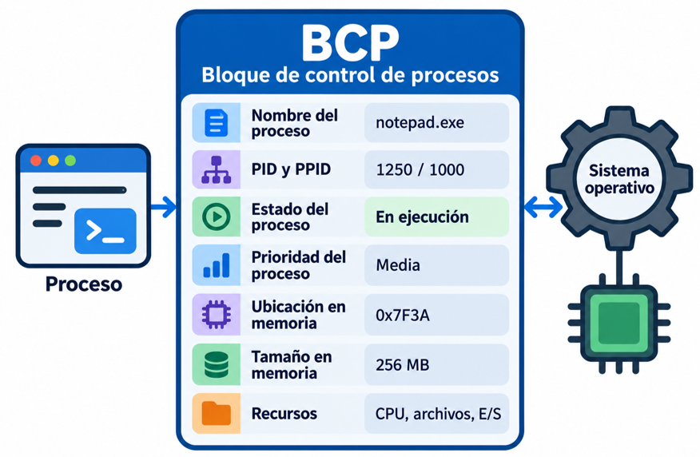
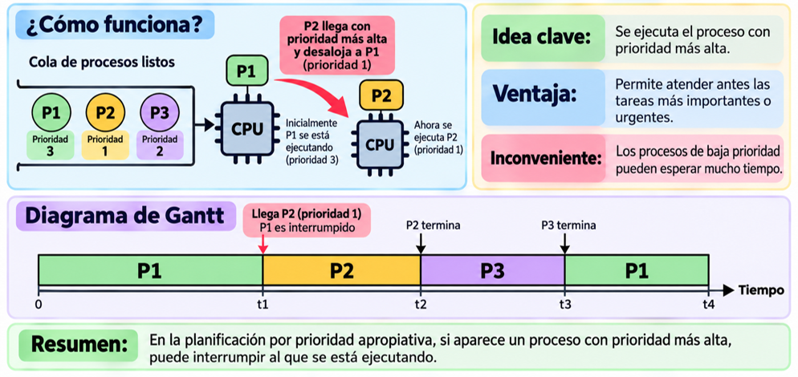
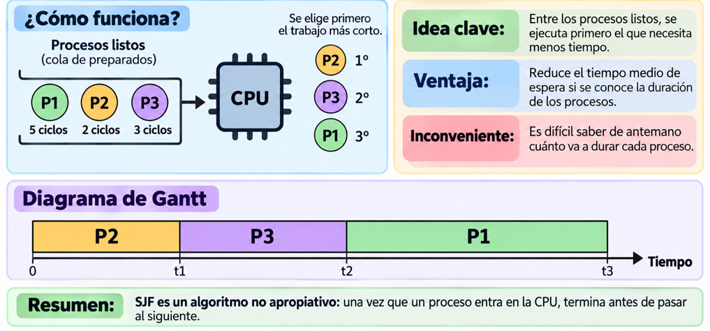
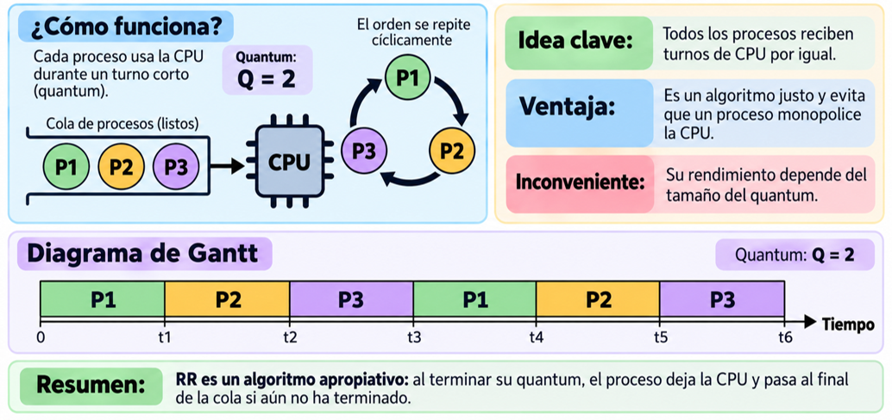

# UT2.2 Gestión de los recursos de un SO: Los procesos

## Procesos	

```note
Un **proceso** es un concepto manejado por el sistema operativo y que hace referencia a un conjunto de instrucciones de un programa en ejecución cargado en memoria.
```

A los procesos, dependiendo del sistema operativo utilizado, se les denomina también **flujos de control**, **tareas**, **hebras o hilos (threads)**, dependiendo del contexto.

Los SO son los encargados de gestionar los recursos de hardware requeridos (principalmente el uso de la CPU o E/S), atendiendo a las diferentes prioridades cuando se ejecuta más de un proceso de forma concurrente (en SO multitarea).



### SO monotarea

Si trabajásemos con un **sistema operativo monotarea** (como *MS-DOS* en su día) la gestión de procesos sería muy sencilla: la CPU ejecutaría todas las instrucciones del proceso de un programa hasta finalizar y solo en ese momento continuaría con otro proceso en cola si lo hubiera.



> 👉 El problema de este tipo de sistemas se hace evidente ya que mientras no finaliza la ejecución de un programa no puede pasarse a otro desaprovechando recursos y tiempo.

### SO multitarea

```note
En la actualidad la mayoría de sistemas operativos son **multitarea**.
```

El SO está hecho para permitir a los procesos ejecutarse una fracción de tiempo muy pequeña, de tal forma muchos procesos de distintos programas se han ejecuten en **lapsos diminutos** de tiempo. En un SO multitarea se aprovechan los tiempos de espera entre recursos y CPU de forma que esta se mantiene siempre trabajando. 



```note
En un SO multitarea se aprovechan los tiempos de espera entre recursos y CPU de forma que esta se mantiene siempre trabajando. Esta técnica se conoce como **multiprogramación** y tiene como finalidad conseguir un mejor aprovechamiento de la CPU.
```

> 👉 Esta técnica se conoce como **multiprogramación** y tiene como finalidad conseguir un mejor aprovechamiento de la CPU

### Diagramas de Gantt

Para la resolución de ejercicios prácticos/teoría usaremos un tipo de diagramas ampliamente utilizado en informática denominados **diagramas de Gantt.**

```note
Un **diagrama de Gantt** es una representación gráfica para representar el tiempo de dedicación previsto para diferentes tareas o procesos a lo largo de un tiempo total determinado.
```



Diagrama de Gantt de la ejecución de dos procesos **P1** y **P2** en un SO monotarea. El tiempo **t** en este tipo de diagramas se mide en **ciclos de procesador**.

### Hilos (threads)

```note
💡 Se denomina **hebra** o **hilo** a un punto de ejecución cualquiera en un proceso. Un proceso tendrá siempre una hebra, en la que corre el propio programa, pero puede tener más hebras.
```

Un proceso clásico es aquel que solo posee un **hilo**.
> Si por ejemplo ejecutamos un procesador de textos como Word, con un solo documento abierto, el programa Word convertido en proceso estará ejecutándose en un único espacio de memoria (con acceso a archivos, galerías de imágenes, corrector ortográfico..). Este proceso, de momento, tendrá una hebra. Si en esta situación, sin cerrar Word abrimos un nuevo documento, Word no se volverá a cargar como proceso. Simplemente el programa, convertido en proceso, tendrá a su disposición **dos hebras **o hilos diferentes, de tal forma que el proceso sigue siendo el mismo (el original). Word se está ejecutando una sola vez y el resto de documentos de texto que abramos serán hilos o hebras del proceso principal, que es el propio procesador de textos.

La creación de un nuevo hilo es una característica que permite a una aplicación realizar varias tareas a la vez (concurrentemente). Los distintos hilos de ejecución comparten una serie de recursos tales como el espacio de memoria, los archivos abiertos, situación de autenticación, etc. Esta técnica permite simplificar el diseño de una aplicación que debe llevar a cabo distintas funciones simultáneamente.


## Estados y transiciones de los procesos	

Existen **tres estados** para los procesos (o hilos correspondientes):

- 🟢 **En ejecución:** El procesador está ejecutando instrucciones del proceso cargado en ese momento (tiene su atención y prioridad)

- 🔵 **Preparado, en espera o activo:** El proceso está preparado para ser ejecutado y esperando su turno para ser atendido por la CPU.
    
- 🟠 **Bloqueado:** El proceso ha entrado en un estado de bloqueo que puede darse por causas múltiples (acceso a un mismo fichero, errores..)
    
 > En algunas biografías pueden utilizarse también los estados **nuevo** y **terminado** .
    
    
Una vez que un programa se ha lanzado y se ha convertido en proceso, puede atravesar varias fases o **estados** hasta que termina.


Los cambios de estado en los que se puede encontrar un proceso es lo que se denomina **transiciones**:

- **Transición A**. Ocurre porque el proceso que está en ejecución necesita algún elemento, señal, dato, para poder continuar ejecutándose.

- **Transición B**. Ocurre cuando un proceso ha utilizado el tiempo asignado por la CPU y deja paso al siguiente proceso.

- **Transición C**. Ocurre cuando el proceso que está preparado pasa a estado de ejecución en la CPU. 

- **Transición D**. Ocurre cuando el proceso pasa a preparado, es decir, al recibir la orden o señal que estaba esperando en estado de bloqueado.

### Esquema de estados principales


### Esquema de estados ampliados

En el siguiente esquema se muestran los estados ampliados de los procesos incluyendo estados de suspensión:



En el siguiente diagrama observamos tres procesos (*o hilos*) pasando de estado de ejecución a quedar en espera o bloqueados:


Del que un proceso cambie de estado en un momento u otro se encarga el **planificador de procesos del sistema operativo.**

```note
💡 El **planificador** de un sistema operativo se encarga de asignar **prioridades** a los diferentes procesos para llevar a cabo su ejecución en el menor tiempo y de la forma más óptima posible.
```

Mediante técnicas que veremos a continuación, se consigue indicar a la CPU del ordenador que procesos deben ejecutarse en qué momento concreto y los diferentes estados que deben ir adoptando. Ello se lleva cabo mediante **algoritmos de planificación**.

Como hemos visto, cualquier proceso, pasará por diferentes estados y el cambio de un estado a otro no es trivial y tanto la forma como el tiempo para hacerlo marcarán la eficiencia del sistema. 

```note
Un **cambio de contexto** consiste en interrumpir la ejecución de un proceso para comenzar o seguir con otro.
```


## Bloque de control de procesos	

```note
💡 La información de un proceso que el sistema operativo necesita para controlarlo se  guarda en un **bloque de control de procesos o BCP**. 
```

En el **BCP** cada proceso almacena información como:

- Nombre del proceso
- **Identificador del nombre e identificador del proceso**. A cada proceso se le asigna un identificador denominado **PID**. Si tiene un proceso padre se identificará a su vez con su **PPID**.
- **Estado actual del proceso**: Ejecución, preparado o bloqueado.
- **Prioridad del proceso**. Se la asigna el planificador o el usuario de forma manual.
- **Ubicación y tamaño usado en memoria**. Dirección de memoria en la que está cargado el proceso y espacio utilizado.  
- **Recursos utilizados**. Otros recursos hardware y software para poder ejecutarse.




### PID

Los procesos se marcan en su creación con un número único llamado identificador de proceso (PID). Salvo el proceso raíz, todos los procesos llevan dos números:

- El **PID** que lo identifica a él.
- El **PPID** que identifica a su padre.

Después de que un proceso genera un hijo, ambos continúan ejecutándose desde el punto en el que se hizo su creación.


## Algoritmos de planificación

```note
💡 Un **algoritmo** es una serie ordenada de instrucciones o pasos o que llevan a la solución de un determinado problema.
```

Los hay tan sencillos y cotidianos como seguir la receta del médico, abrir una puerta, lavarse las manos, etc; hasta los que conducen a la solución de problemas muy complejos.

1.  Tomar el cepillo de dientes
2.  Aplicar crema dental al cepillo
3.  Abrir el grifo
4.  Remojar el cepillo con la crema dental
5.  Cerrar el grifo
6.  Frotar los dientes con el cepillo
7.  Abrir el grifo
8.  Enjuagarse la boca
9.  Enjuagar el cepillo
10. Cerrar el grifo

    
Gracias a los **algoritmos de planificación** usados en SO multiproceso, la CPU se encarga de asignar tiempos de ejecución a cada proceso según el tipo de algoritmo y la prioridad de cada proceso.

El objetivo de un algoritmo de planificación es decidir qué proceso se ejecuta en cada momento en la CPU de un SO multitarea.

Dichos algoritmos pueden ser de dos **tipos**:

-   **Apropiativos**: un proceso puede ser interrumpido por otro para dejarle acabar.
-   **No apropiativos**: una vez un proceso entra en la CPU no se libera hasta terminar. 

Los algoritmos de planificación usados en SO actuales que veremos son:
-   **Algoritmo FIFO** (*First Input First Output*)
-   **Algoritmo SJF** (*Shortest Job First*)
-   **Algoritmo de rueda** (*Round Robin*)
-   **Algoritmo basado en prioridad**


### Algoritmo FIFO

**FIFO** ejecuta los procesos siguiendo el **orden** en el que llegan a la cola de preparados. El primer proceso que llega es el primero que obtiene la CPU.
Una vez que un proceso comienza a ejecutarse, mantiene la CPU hasta que termina, por lo que se trata de un algoritmo no apropiativo.

**Características:**

- No apropiativo (La CPU no se libera hasta haber terminado) 
- Muy sencillo de comprender e implementar.
- Respeta el orden de llegada de los procesos.
- Un proceso largo puede hacer esperar mucho tiempo a procesos más cortos que hayan llegado después.

👉🏻  Idea clave: el primero que llega es el primero que se ejecuta.

-   **No apropiativo** (**La CPU no se libera hasta haber terminado**)
-   Es justo, aunque los procesos largos hacen esperar mucho a los cortos.
-   El tiempo medio de servicio es muy variable en función del número de
    procesos y su duración.


### Algoritmo basado en prioridad

Otro tipo de algoritmos usados en SO modernos son los basados en **prioridades**. En ellos se asocia una prioridad a cada proceso y la CPU se asigna al trabajo con la prioridad más alta en ese momento.

Se trata de un algoritmo **apropiativo**. Si se está ejecutando un proceso de prioridad media y entra un proceso de prioridad mayor, se requisa la CPU al primer proceso y se le entrega al proceso de mayor prioridad.

**Características:**

- Permite ejecutar antes los procesos considerados más importantes.
- Apropiativo: un proceso puede ser interrumpido si aparece otro con mayor prioridad.
- Cuando finaliza el proceso prioritario, puede continuar el proceso que había sido interrumpido.





### Algoritmo SJF

El algoritmo **SJF** (*Shortest Job First* ) que significa ‘el trabajo más corto primero’. Se trata de un algoritmo que supone que los tiempos de ejecución ya se conocen de antemano, algo que no siempre es posible saber. 

Cuando hay varios procesos preparados esperando la CPU, el planificador selecciona aquel que necesita **menos tiempo de ejecución**.

**Características:**

- Selecciona primero los procesos más cortos.
- Es un algoritmo no apropiativo.
- Muy complicado de implementar, necesario predecir los tiempos de ejecución de los procesos con antelación.
- Se considera relativamente óptimo.



### Algoritmo RR (rueda)

El algoritmo **RR** (*Round Robin*) o de la **rueda** es uno de los algoritmos más sencillos y utilizados en sistemas Windows y Linux. 

Round Robin reparte la CPU entre los procesos preparados por turnos. Cada proceso puede utilizarla durante un pequeño intervalo de tiempo denominado quantum (Q). Si el proceso termina antes de consumir su quantum, abandona la CPU. Si el quantum se agota y todavía no ha terminado, el proceso se interrumpe y pasa al final de una cola **FIFO**, dejando paso al siguiente.

**Características:**

-   Apropiativo
-   Es un algoritmo **justo** (evita la monopolización de la CPU)
-   Su rendimiento depende del valor de **Q**
-   Usa FIFO para la gestión de la cola de procesos.

El *quantum* **Q** suele definirse entre unos *20ms*o *50ms*




### Ejemplos de algoritmos

Algunos **conceptos** importantes que usaremos a la hora de completar las tablas de los problemas de los diferentes algoritmos de planificación:

- **Ciclo de llegada:** Momento en el que llega un proceso al planificador de procesos del SO.
- **Ciclos de ejecución**: Ciclos de CPU que consume un proceso mientras se encuentra en estado de ejecución
- **Tiempo de espera**: Tiempo que un proceso está esperando en la cola de procesos preparados o listos.
- **Tiempo de retorno**: Tiempo que transcurre desde que un proceso llega, hasta que sale (tiempo que tarda en ejecutarse)


- Representa en forma de diagrama de Gantt del **algoritmo FIFO** para la siguiente lista de 5 procesos (*A,B,C,D,E*): 


- Representa en forma de diagrama de Gantt del **algoritmo SJF** para la siguiente lista de 5 procesos (A,B,C,D,E): 


- Representa en forma de diagrama de Gantt del **algoritmo RR con q**=**2** para la siguiente lista de 5 procesos (A,B,C,D,E):


- Representa en forma de diagrama de Gantt del **algoritmo de Prioridad** para la siguiente lista de 5 procesos (A,B,C,D,E): 


## Interrupciones y excepciones

Las interrupciones y las excepciones son mecanismos que tienen los sistemas operativos para gestionar situaciones que requieren atención inmediata o especial, interrumpiendo el flujo normal de ejecución de las instrucciones de un programa. 

A pesar de que ambos conceptos están relacionados con la alteración del flujo de un programa, se diferencian tanto en su origen como en la forma en que son manejados. 

### Interrupciones

```note
💡 Una **interrupción** es una señal que obliga al SO a tomar el control del procesador para estudiarla y tratarla.
```

Las interrupciones son un mecanismo que permite que el hardware comunique eventos y es fundamental en sistemas multitarea y en el manejo de dispositivos de entrada/salida. A cada momento se producen miles de interrupciones manejadas con total normalidad por el SO.

Por ejemplo, si un usuario pulsa una tecla en un teclado, o si un paquete de datos llega a una tarjeta de red, se genera una interrupción de hardware. El sistema operativo detiene temporalmente la ejecución del programa actual, gestiona el evento (por ejemplo, leyendo el valor de la tecla pulsada), y luego vuelve a continuar la ejecución del programa en el punto en que fue interrumpido, dando la impresión de que todo funciona a la vez (multitarea).


### Excepciones

```note
💡 Una **excepción** es un evento que ocurren durante la ejecución de las instrucciones de un programa, como resultado de una operación que genera una condición anómala o un **error**.
```

A diferencia de las interrupciones, que son provocadas por señales externas, las excepciones son generadas internamente por el procesador como respuesta a situaciones inesperadas durante la ejecución de un programa o aplicación (que puede ser el propio SO).

Es el proceso o el propio programa el que intenta llevar a cabo el manejo y control de dicho error abortando su ejecución.


### Comparativa entre interrupciones y excepciones


|                      **Interrupciones**                      |                       **Excepciones**                        |
| :----------------------------------------------------------: | :----------------------------------------------------------: |
| Las interrupciones se presentan inesperadamente y sin relación con el proceso en ejecución. Son parte intrínseca del funcionamiento de cualquier sistema. | Las excepciones se producen como efecto directo de una instrucción concreta del proceso que se esta ejecutando. |
| El SO atiende la interrupción y a continuación continúa con al ejecución del proceso con la que estaba. | Aparecen por defectos de programación y errores graves. Son fallos no recuperables. |
| Si se producen varias interrupciones simultáneamente, sólo se tratará una, quedando bloqueadas el resto. |          Las excepciones se producen de una en una.          |


